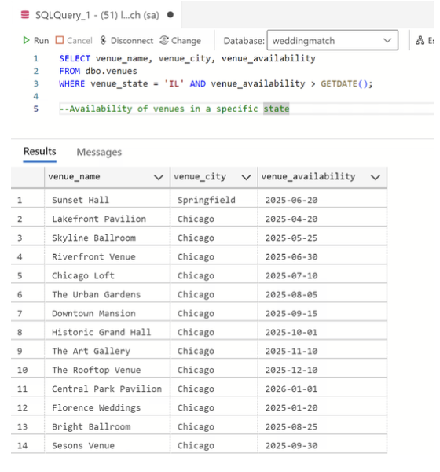
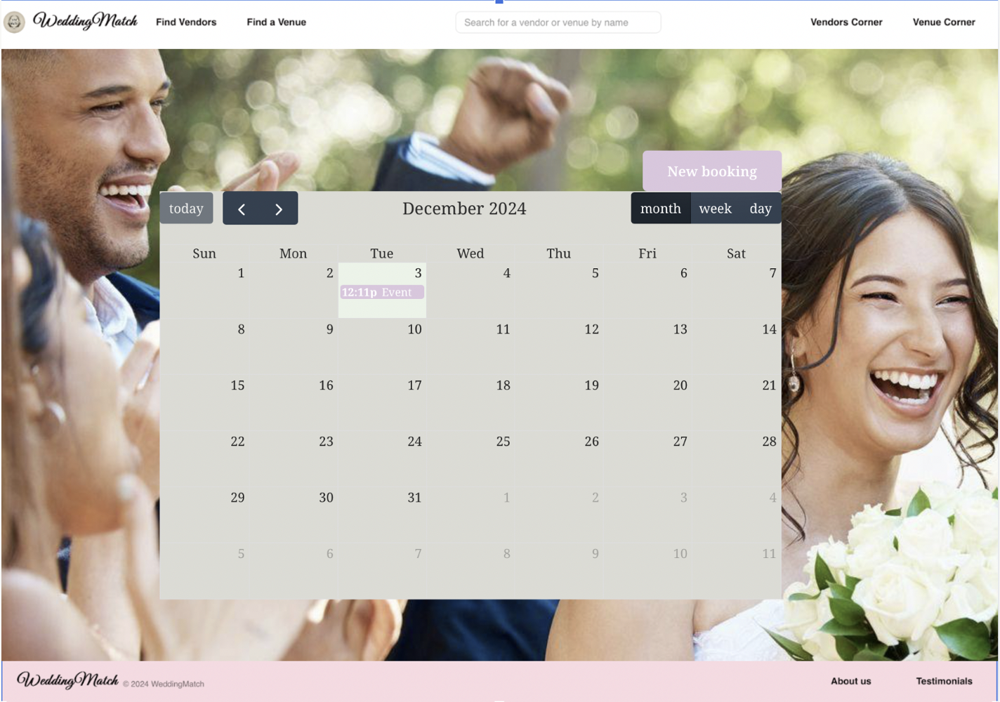

<h1>Wedding Match</h1>

<h2>Introduction</h2>

Planning a wedding can be overwhelming. Couples have to choose a venue, see whether it has a liquor license, hire a caterer, decide on decor and flower arrangement, find a photographer or videographer, and choose entertainment like a DJ or band. Each of these elements affects the total cost of the wedding, which may in turn impact the number of guests the couple can invite. Without a centralized database, it becomes challenging to coordinate all of these elements and to ensure couples stay within budget. Vendors also encounter challenges. In a crowded market, it can be difficult for them to find clients, and to make their availability, prices, and services offered known to potential clients.

Wedding Match is a database for both clients and vendors/venues for managing wedding planning services. The system allows wedding planners to organize and manage all aspects of a wedding event including vendor details, client information, scheduling and budgeting. The system centralizes client and vendor information in a secure, easily accessible format; tracks budget, payments and deadlines; and provides a smooth communication channel for feedback, changes and updates between the client, planner and vendors. 

We match couples with vendors and venues to plan their perfect wedding, and give vendors and venues the opportunity to make their services, prices, and availability known to prospective clients. This wedding planner database will allow parties involved in the planned process (Vendors, Clients) to access relevant information in real-time. This allows for a more seamless experience on both ends, and should allow vendors to increase their business by reaching out to couples. Couples can query the system to find out which vendors are available in specific locations on a given date, and/or whether a vendor is willing to travel to their preferred location.

The primary end users of this database are couples seeking venues and specific services for their wedding; by using vendors whose information is in this system, couples can also ensure that the total cost of their wedding fits within their overall budget. Vendors can also use the system to reach out to prospective clients to offer their services, and to easily let potential clients know when they are and are not available.

<h2>Design Report</h2>

The project database system consists of 4 tables. The tables are Clients, Vendors, Venues,
and Budget. The relationships between tables are shown in the ERD below. Each client can hire zero or more vendors, and each vendor can be hired by zero or more clients. Each client can rent only one venue on one date, and each venue can only be rented by one client on one date. Each client has one total budget. A screenshot of our Excel spreadsheet listing entities, attributes, and relationships is below.

  

<h3>Conceptual Model Diagram:</h3>

  

<h3>Logical Model Diagram:</h3>

  

<h2>Database/Business Rules</h2>

<ol>
  <li>
    Each client only has one budget, rents out only one venue, but can hire zero or more vendors.
    <ul>
      <li>This was implemented through the foreign key matches of <code>budget_client_id</code>, <code>budget_vendor_id</code>, and <code>budget_venue_id</code> in the <code>budgets</code> table. When paired with a unique constraint for the two variables, this acts as a way for there not to be multiple pairs of <code>budget_client_id</code> and <code>budget_venue_id</code>.</li>
    </ul>
  </li>
</ol>

  

<ol start="2">
  <li>
    Each client can only have their wedding when the venue and vendor are available.
    <ul>
      <li>This was implemented through triggers that raise an error if the venue or vendor availability is after the client’s event date. The venue or vendor can be available before the event date because we are assuming that the client would prefer an event sooner rather than later.</li>
    </ul>
  </li>
</ol>

  

<ol start="3">
  <li>
    Each venue can only accommodate a wedding party of a maximum size.
    <ul>
      <li>If the client’s wedding size exceeds the venue capacity, the transaction cannot be completed. This is illustrated in the trigger below that raises an error if the wedding size is larger than the venue capacity.</li>
    </ul>
  </li>
</ol>

  

<h2>Physical Design (SQL Walk-Through)</h2>

<ul>
  <li><a href="final_project_weddingmatch.sql">Full SQL</a></li>
</ul>

<ol>
  <li>
    Client and Vendor Tables
  </li>
</ol>

  

<ol start="2">
  <li>
    Venue and Budget Tables
  </li>
</ol>

  

<ol start="3">
  <li>
    Lookup Tables
  </li>
</ol>

  

<h2>Example Data and Queries</h2>

We utilized a dataset comprising 40 entries distributed across clients, venues, vendors, and budgets to populate our database. These entries were designed to reflect real-world wedding planning scenarios, ensuring diverse and relatable data points. The dataset enabled us to test and showcase the functionality of our queries effectively, highlighting the database's capability to support wedding planning operations.

The database has five main entities: Clients, Vendors, Venues, Budgets, and lookup tables for
payment methods and statuses.
It helps: 
<ol>
  <li>Clients find venues and vendors for their events.</li>
  <li>Vendors showcase their services and manage bookings.</li>
  <li>Track payment statuses and budgets efficiently.</li>
</ol>

<h3>Query 1:</h3>

<strong>Title</strong>: List of Clients with their chosen Venues and Vendors

<strong>Use Case</strong>: Helps wedding planners identify which clients are linked to specific venues and vendors.

  

<h3>Query 2:</h3>

<strong>Title</strong>: Vendors Willing to Travel for Upcoming Events

<strong>Use Case</strong>: Assists clients in finding mobile vendors for events outside their base city.

  

<h3>Query 3:</h3>

<strong>Title</strong>: Total Budget for a Specific Client

<strong>Use Case</strong>: Quickly identify and review budget allocations for individual clients.

  

<h3>Query 4:</h3>

<strong>Title</strong>: Availability of Venues in a Specific State

<strong>Use Case</strong>: Enables planners to filter venues by state and future availability.

  

<h3>Query 5:</h3>

<strong>Title</strong>: Payment Status Summary

<strong>Use Case</strong>: Provides an overview of payment statuses to help planners follow up on pending or overdue payments.

  

<h3>Query 6:</h3>

<strong>Title</strong>: Vendors with Costs Under a Specific Threshold

<strong>Use Case</strong>: Helps clients stay within their budget by identifying cost-effective vendors.

  

<h3>Query 7:</h3>

<strong>Title</strong>: Clients with Special Requests

<strong>Use Case</strong>: Allows planners to personalize services for clients with special requests.

  

<h2>Interface Design</h2>

<h3>Landing Page</h3>

  

<h3>Featured Vendors and Venues Page</h3>

  

<h3>Booking Page</h3>

  

